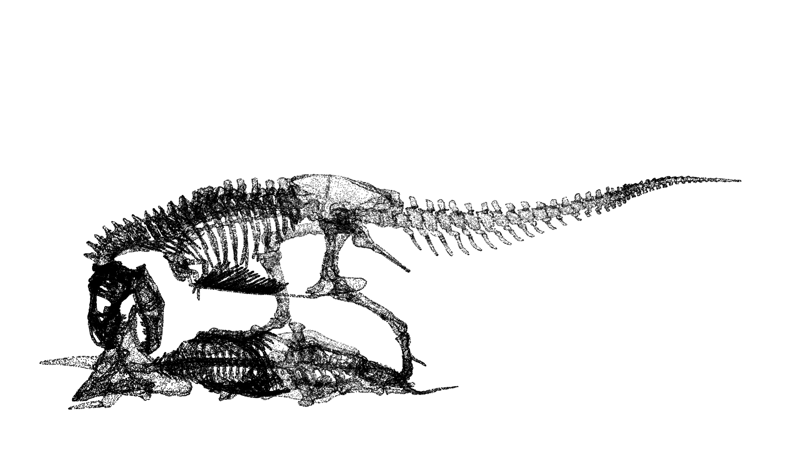

# Examples for UMAP reduction using 3D models of prehistoric animals

The models are taken from the [Smithsonians 3D-scanning efforts](https://3d.si.edu/). I have included the datapoints for a Wolly Mammoth and a Tyrannosaur eating a Triceratops in the two .csv-files. 

The Jupyter-Notebook contains code to produce [UMAP-embeddings](https://github.com/lmcinnes/umap), which are continously shifting with changes in the hyperparameters, as can be seen below. I tend to think that such animations should, wherever possible, be produced when UMAP-plots are published, so that the viewers can judge for themselves which properties remain constant under different parameters, and which are mere artefacts of a specific hyperparameter-setting or random-state.

## Here is an image of the original Mammoth:

## And here are 2D-embeddings of it with shifting hyperparameters:

## And this is the T-Rex, and a series of embeddings with different random-states

